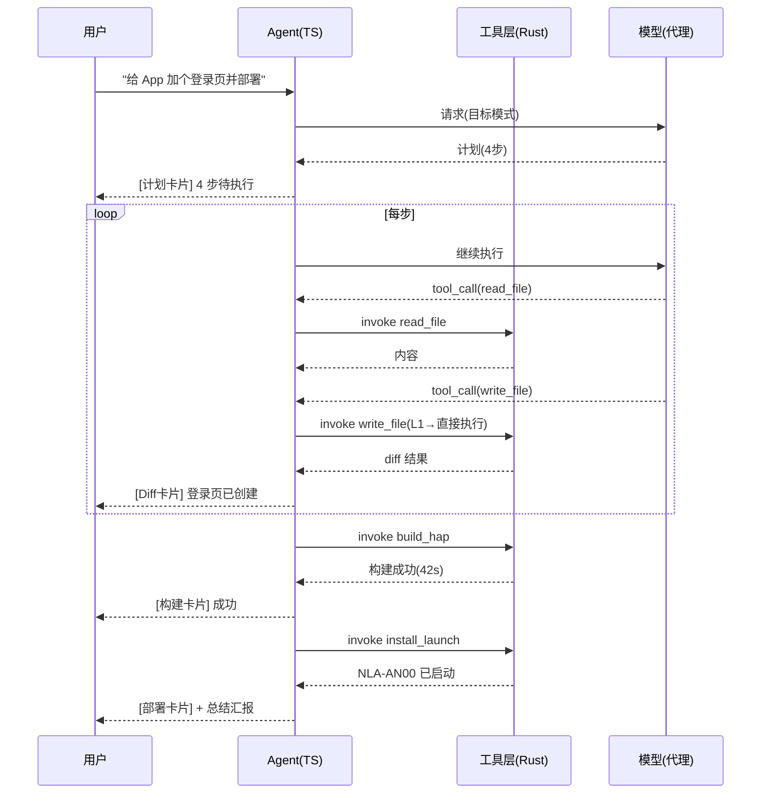
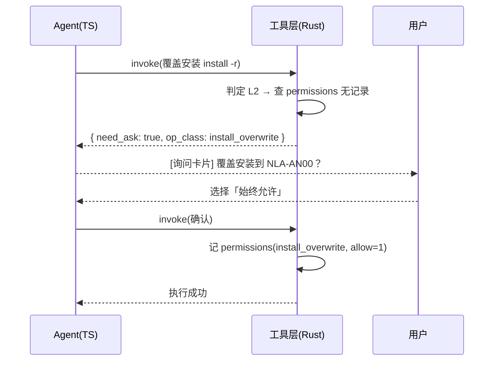

# DevEco Agent — 架构设计文档 v2

> 定位：**对话式鸿蒙开发助手** —— 像 ChatGPT 桌面 / Qoder / Trae Work 一样轻，但专注鸿蒙。
> 产品形态：**任务模式优先**（非传统 IDE 模式），见 §1.2。
> 不做完整 IDE，只做「打开项目 → 下达任务 → Agent 帮你写/改/构建/部署」这一件事，并且把它做到顺手。

---

## 1. 产品定位

### 1.1 一句话定位

> 选中一个鸿蒙工程，用自然语言告诉它你想干什么（"做一个记账 App"、"把首页改成深色"、"部署到 NLA-AN00"），它自己读代码、改代码、跑构建、装到真机，过程全程可见、可打断。

### 1.2 产品形态：任务模式（第一原则）

**用户不与代码直接打交道，只下达任务、验收结果。** Agent 是唯一的执行者，对话流是唯一的过程呈现。

| 维度 | 传统 IDE 模式（DevEco Studio） | 任务模式（本产品） |
|---|---|---|
| 用户与代码的关系 | 直接打开文件编辑、点按钮 | 一句话下达任务，Agent 改代码 |
| 过程呈现 | 编辑器 / 终端 / 各类面板 | 对话流中的卡片（计划/工具/Diff/构建/部署） |
| 文件查看 | 文件树 + 多标签编辑器 | 点击卡片中的文件路径 → 弹层查看（只读优先） |
| 状态入口 | 分散在面板 | 会话历史即一切状态 |
| 用户动作 | 菜单 / 快捷键 / 鼠标 | 一句话（快捷按钮 = 预填指令，同一管线） |

> **演进说明**：先走任务模式。未来若需要用户手动精修代码，再在弹层上演进文件树编辑等 IDE 能力，不阻塞当前主线。

### 1.3 与专业 IDE 的边界（**明确砍掉什么**）

| 能力 | 专业 IDE（DevEco/Trae） | 本产品 |
|---|---|---|
| 代码编辑 | 多标签工作台 + LSP + 重构 | 只读浏览 + 简单编辑弹层；Agent 改代码展示 Diff |
| 终端 | 独立终端面板 | **不做**。命令输出以「卡片」形式出现在对话流里 |
| 文件管理 | 完整文件树 + 拖拽 + 重命名 | 精简文件列表，够看够定位 |
| 插件/Skill 市场 | 完整生态 | 保留现有 Skill 管理页，不与 Agent 核心耦合 |
| MCP | 一等公民 | 一期不做，二期做（M6）：stdio/SSE 桥 |
| 补全/跳转 | LSP 全量 | 只做 ArkTS 高亮 + @Entry/@Router 符号识别 + grep 兜底 |

> 原则：**一个功能如果 80% 的使用场景用不上，就不做**。把省下的复杂度全部投入到「对话体验」和「鸿蒙理解」上。

### 1.4 目标场景

1. **多 App 并行开发** — 项目列表切换，各项目独立会话与成本
2. **目标驱动开发** — "做个记账 App" → Agent 自主规划 → 执行 → 构建 → 部署
3. **一键部署** — 构建 + 安装 + `aa start` 拉起，全过程一个按钮或一句话
4. **多模型自由切换** — 华为 / 智谱 / 通义 / 自建，自动故障转移

### 1.5 与主流对话式 Agent 工具的功能差异（对标 Qoder / Trae Work / ChatGPT 桌面）

**我们比它们强的（差异化，不做就会丢掉的产品价值）**：

| 能力 | 说明 |
|---|---|
| 鸿蒙工程深度理解 | ProjectIndex（结构/路由/签名/构建错误解析），专用而非通用（§7.3） |
| 一键真机闭环 | 构建 → hdc 安装 → aa start 拉起，对话直达设备（§2.4） |
| 多模型 failover + 成本 | 本地代理自动切换 + 费用按项目归属（§7.1 / §7.5） |
| 权限零询问（Qoder 风格） | 信任一次 + 全自动 + 红色警示 + 三件套可撤销（§3） |
| 自动分支工作流 | 任务自动建 agent/ 分支，可回滚可合并（§4.5） |
| 本地隐私 | 数据全本地（SQLite + 本地代理），key 不出本机 |

**主流工具有、我们必须补齐的（低成本高收益）**：

| 缺口 | 落点 |
|---|---|
| @ 引用文件/上下文（输入框 @ 选文件） | §2.5 |
| 图片输入（截图/粘贴图问问题） | §2.5 / §7.1 |
| 全局自定义指令（Rules 编辑 UI） | §10 |
| 会话搜索 + 自动标题 | §7.5 |
| 会话内 token/成本显示 | §7.2.2 |
| 任务一键回滚（回到任务前） | §4.5 |
| 快捷键（构建/部署/新会话） | §2.4 |

**暂不做**：仅**语音输入**一项明确排除；其余主流能力全部纳入二期规划（§13 M6/M7）：多 Agent 并行、模型同题对比、命令面板、完整 MCP、语义 RAG。浏览器预览不适用（鸿蒙无浏览器渲染，以真机/模拟器替代）。

### 1.6 体验底线：全网差评避坑承诺

> 来源：Qoder / Trae / Cursor / Claude Code 公开差评与实测报告（2025-2026）逐条提炼。**别人踩过的坑，我们一开始就避开**；每条都有对应设计，可验收。

| 全网差评（用户原话） | 我们的对策 | 对应设计 |
|---|---|---|
| "对话越来越长，回答变慢、跑偏" | 85% 预算线自动压缩 + 手动压缩按钮 | §7.2.2 |
| "达到限额点继续，上下文就丢了" | 会话全量持久化（SQLite），压缩只影响发送给模型的上下文，历史永远可查 | §7.2.2 / §7.5 |
| "修着修着把 bug 当主任务，忘了目标" | 目标锚定条常驻 + 失速检测自动拉回 | §4.6 |
| "Ai 原地打转，把修好的又改回去" | 同文件反复修改未验证强制构建 + 失败方案黑名单 | §4.6 |
| "额度烧太快、账单不明" | 每条消息 tokens/成本可见 + 项目级聚合 + 压缩省钱 | §7.2.2 / §7.5 |
| "大项目卡顿崩溃、LSP 集体罢工" | Rust 索引不阻塞 UI + 单窗口单流 + 性能预算 | §5 / §7.3 / 下表 |
| "一直显示思考中，没结果" | 步骤状态实时可见（待办/进行中/成功/失败）+ 超时提示 | §2.2 / §4.6 |
| "沙箱和真实环境搞混" | 单机直连真机与本地文件，无沙箱概念，天然无此问题 | §3 |
| "权限问个不停" | 信任一次 + 默认零询问 + 三件套可撤销 | §3 |
| "换工具后要把上下文重新讲一遍" | 任务状态卡持久化，新会话可一键继承（"继续这个任务"） | §4.6 |
| ChatGPT 2026.7 改版："Token 刺客"（聊天也扣编程额度，账单不明） | 用量全透明 + 问答/目标模式统一计费展示 + 压缩省钱 | §7.2.2 |
| ChatGPT："AI 自动删了本地文件"（权限失控事故） | 删除进回收站可恢复 + 红色警示 + 路径白名单 | §3 |
| ChatGPT："更新后 5 年对话记录直接没了"（迁移灾难） | 迁移只增不改（§8 纪律）；历史数据永不移除，压缩永不丢 | §8 / §7.2.2 |
| ChatGPT："Windows 被亏待"（官方承认） | Windows 一等公民：全链路原生 + 执行/编码规范 | §7.4 |

**性能预算（M0 起即验收）**：应用冷启动 < 1s；打开大工程建索引 < 5s 且不阻塞 UI；对话滚动 60fps；常驻内存 < 300MB（不含模型服务，WebView2 基座 ~120-200MB 是最大头，细则见 §7.4.6 内存与卡死防线）。

---

## 2. 界面与交互

### 2.1 主窗口布局

```
┌──────────────┬──────────────────────────────────────────┬──────────────┐
│ 侧边栏 (240px)│  对话主区（唯一工作区）                     │ 右侧面板      │
│              │                                          │ (默认折叠,    │
│ ▸ 项目        │  ┌────────────────────────────────────┐  │  仅详情查看) │
│   · 记账App ● │  │ [模型选择] [🚀构建] [📱部署] [✨新建页]│  │  ▸ 工程概览  │
│   · 打卡App   │  │  ◄ 快捷操作条（=预填指令，同一管线）  │  │  ▸ 文件浏览  │
│   · 天气App   │  ├────────────────────────────────────┤  │  ▸ 设备状态  │
│ ▸ 会话（记账App）│  │  用户：做一个记账 App                 │  │              │
│   · 加个登录页 │  │  ┌─ Agent 计划卡片 ──────────────┐  │  │              │
│   · 部署 v0.2 │  │  │ 1. 建工程结构  2. 写页面        │  │  │              │
│   · ＋ 新会话   │  │  │ 3. 接数据存储 4. 构建部署  ✓✓  │  │  │              │
│              │  │  └───────────────────────────────┘  │  │              │
│ ▸ 设置        │  │  [📄 新建 pages/Home.ets] 已创建     │  │              │
│              │  │  [🔨 构建] assembleHap 成功 42s      │  │              │
│              │  │  [📱 部署] NLA-AN00 已启动           │  │              │
│              │  │  Agent：完成！共改动 6 个文件...      │  │              │
│              │  ├────────────────────────────────────┤  │              │
│              │  │  输入框 [打字或粘贴图片]  [发送]      │  │              │
│              │  └────────────────────────────────────┘  │              │
└──────────────┴──────────────────────────────────────────┴──────────────┘

> 布局原则：**主区永远是对话**。右侧面板只是「详情查看」（工程概览、文件浏览、设备状态），默认折叠，不承载任何编辑/操作职能；文件浏览仅用于定位，点击文件在弹层打开（§2.3）。
> **项目-会话强绑定**：会话列表永远跟随当前选中项目（每个项目各自独立一组会话，见 §7.5），切换项目即切换整组会话与 Agent 上下文。
```

### 2.2 对话流中的卡片类型（核心交互单元）

| 卡片 | 触发 | 内容 | 交互 |
|---|---|---|---|
| **计划卡片** | Agent 进入目标模式 | 步骤列表 + 状态（待办/进行中/完成） | 可折叠、可勾选跳过某步 |
| **工具卡片** | 每次工具调用 | 工具名 + 参数摘要 + 状态 + 耗时 | 展开看完整参数/结果 |
| **文件卡片** | 读/写/编辑文件 | 路径 + 改动统计（+N -M 行） | 点击打开 Diff 视图 |
| **Diff 卡片** | Agent 改完代码 | 逐文件 unified diff | 可逐块「接受/拒绝」后继续对话 |
| **构建卡片** | 构建/命令执行 | 命令 + 实时日志 + 退出码 | 可取消；失败时附错误摘要 |
| **部署卡片** | 安装/启动 | 设备、bundleName、hdc 输出 | 失败时附解决建议 |
| **询问卡片** | Agent 需要决策 | 完整交互模式见 §2.7 | 推荐选项 / 自定义输入 / 快捷键 |

> 设计要点：**所有机器动作都以卡片形式"可见"地出现在对话流中**，用户不用切面板就能追踪 Agent 在干什么 —— 这是 Trae/Qoder 的通用做法，也是"好用"的根基。

### 2.3 文件查看（任务模式下唯一的"看代码"方式）

- 入口：点击任意卡片中的文件路径（Diff 卡片 / 工具卡片 / 构建错误行号）→ 弹层打开该文件。
- 弹层：Monaco 只读为主，标注来源（"Agent 修改后" / "当前磁盘内容"）；允许轻编辑（改完回传对话继续，或仅作参考）。
- 无多标签、无文件树主导的编辑工作流 —— 文件是任务的素材，不是用户的办公桌。

### 2.4 快捷操作条（输入框上方，一键直达）

| 按钮 | 动作 | 说明 |
|---|---|---|
| 🚀 构建 | `build_hap(当前模块)` | 增量构建，输出进对话流 |
| 📱 部署 | `install_launch(默认设备)` | 构建→安装→拉起，最后一步自动 `aa start` |
| ✨ 新建页面 | 弹小表单（页面名/路由路径）→ 生成 .ets + 挂路由 | 高频任务模板化 |
| ⚡ 运行 | 选择设备列表下拉 → 部署到指定设备 | |

> 快捷操作本质是**预填的 Agent 指令**：点「部署」= 发送"构建并部署到默认设备，完成后启动 App"，走同一条 Agent 管线，不另写代码。

**快捷键（全局，设置页可改）**：`Ctrl+L` 聚焦输入框 · **`Enter` 发送 · `Shift+Enter` 换行**（与主流一致；`Ctrl+Enter` 保留为"强制发送"备选） · `Ctrl+Shift+B` 构建 · `Ctrl+Shift+D` 部署 · `Ctrl+Shift+N` 新会话 · `Ctrl+K` 搜索会话 · 截图快捷键可配（§2.5）

### 2.5 输入能力：@ 引用与图片（对齐主流工具）

**@ 引用**（输入框内输入 `@` 弹出候选）：

- 文件（按项目文件树/最近访问排序）、会话内容、模型、快捷指令。
- **会话引用已落地（2026-08-20）**：@ 面板追加同项目会话候选（`conv:<id>`），选中即把标题 + 最近内容插入草稿；历史重放时后端注入会话摘要（`messages.summary` 优先，回退最后一条 assistant 内容），与消息引用（Quote）同构。
- 引用即上下文锚定：`@entry/src/main/ets/pages/Home.ets 帮我把这个页面的列表改成卡片式` → 该文件内容自动注入本次请求（无需 Agent 再 read_file）。
- 引用展示为输入框内的小标签（可删除），存进 user 消息的引用字段。

**图片输入**：输入框支持粘贴截图/拖入图片，随消息上传（多模态模型显示缩略图，纯文本模型提示"该模型不支持图片"）；模型路由增加 `vision` 任务类型（§7.1）。

**工具内截图（一键到输入框）**：输入框旁「📷 截图」按钮（快捷键可配）→ `take_screenshot`（Rust）：

| 平台 | 实现 | 说明 |
|---|---|---|
| Windows | `SendInput` 模拟 `Win+Shift+S` | 触发系统截图工具，**默认区域拖拽框选**；窗口/全屏由系统工具栏切换（原生支持，我们不干预选区交互）；自动进剪贴板；失效兜底：提示用户按 `Win+Shift+S` |
| macOS | `screencapture -i -c` | **默认拖拽框选区域**；空格键切窗口模式、无 `-i` 即全屏（系统原生交互）；需屏幕录制权限（首次弹系统授权，失败引导设置页开启） |

- 触发后 2s 内 Rust 轮询剪贴板图片（`read_clipboard_image`）→ 输入框出现"已检测到截图 [缩略图]"→ 确认后随消息发送（走本段图片管线）；「插入剪贴板截图」按钮兜底（覆盖用户自己系统截图）。
- 不自绘选区框（不重复造轮子）：系统截图工具已成熟，我们只做"触发 + 检测 + 插入"。
- 截图属系统级操作，不涉项目权限（L0，无白名单约束）。

**选择即引用**（Trae 同款体验）：Monaco 弹层里选中代码/文本 → 浮动工具条「引用到对话」→ 自动生成 @ 标签带入输入框（附行号区间），无需手动输入路径。

---

### 2.6 输出渲染规范（Agent 消息好看）

**渲染基线**（前端实现）：

- 完整 Markdown（标题/列表/表格/引用/行内码/链接）；表格紧凑样式；行内码等宽高亮。
- 代码块：语言标注 + 语法高亮（ArkTS/TS/JSON5/Shell 重点）+ 右上角复制按钮；>50 行自动折叠（"已折叠 N 行"，点击展开）。
- 流式渲染：增量防抖（300ms），代码块占位防闪烁，表格/列表不跳动。
- 消息气泡：用户右对齐 / Agent 左对齐 / 系统消息灰色居中（压缩通知、自动标题等）；工具输出只进卡片、不进气泡。
- 性能：长会话虚拟滚动（仅渲染可视区）；构建日志卡片按行虚拟化（百万行不卡）。

**结构美化**（提示词约束，§10 同步）：

- **结论先行**：先一句话结论，再展开细节。
- 层级 ≤3；要点列表 ≤5 条；长段落拆条；对比/清单类内容优先用表格。
- 文件路径用行内码标注且**可点击**（Monaco 打开到行）；代码必带语言标注与文件路径。
- 正文不使用 emoji 装饰（状态语义由卡片图标承担），保持专业观感。

**增强**：

- 思考过程：reasoning 模型输出"思考中…"折叠块（默认折叠，可展开）。
- 消息 hover 操作：复制 / 重新生成（重试）/ 编辑重发（改指令重发，原消息保留）。
- 输出截断：max_tokens 截断时自动出「继续生成」按钮（续写复用流式管线）。

### 2.7 确认交互：询问卡片完整模式（需要用户确认的事项）

> 核心原则：询问以**对话流内卡片**呈现（非模态弹窗），任务暂停等待；不打断上下文阅读，不阻塞其他操作（可同时翻看历史/查看卡片详情）。

**一张完整询问卡片**：

```
┌─ 需要你确认 ───────────────────────────────┐
│ 合并冲突：entry 模块 3 个文件冲突，怎么处理？  │ ← 问题 ≤ 1 句话（结论先行）
│                                            │
│ [★ 推荐] 保留我的改动，自动合并 Agent 改动    │ ← 推荐选项（星标 + 理由一句）
│ [ 2 ] 以 Agent 改动为准（我的改动进 stash）   │
│ [ 3 ] 放弃本次任务改动（回到任务前）          │
│ ────────────────────────────────────────── │
│ 自定义… [输入新指令/参数，Enter 提交]          │ ← 始终可用
│ [稍后决定]（任务保持暂停）  [上下文详情 ▾]     │
└────────────────────────────────────────────┘
```

**交互规则**：

| 规则 | 说明 |
|---|---|
| 选项 ≤3 个，第一个为推荐 | Agent 附一句推荐理由；选项必须**具体可执行**（禁"是/否"空泛提问——能给出方案就不问"要不要做"） |
| 自定义输入永远可用 | 可直接回答，也可"选选项后追加补充"（如"选 1，但只合并 entry 模块"） |
| 快捷键 | Enter = 推荐选项；1/2/3 = 选项序号；Esc = 折叠卡片（不答复，任务保持暂停） |
| 等待行为 | 任务暂停，Agent **不自行继续**（防越权）；卡片持久化，离开会话回来仍可答复 |
| 上下文自足 | 卡片自带必要上下文（相关 diff / 日志尾部），默认折叠，不用翻历史 |
| 回复后 | 卡片灰化收起为一行（"待确认：合并方式 → 已选：保留我的改动"），记录可回看 |
| 排队 | 一次只问一个，答复后继续；再需要决策再问下一个（不一次性抛多个问题） |
| 记忆 | 严格模式同类询问记忆到 permissions 表（§3.4） |

### 2.8 四区界面细节规范（对齐主流：Qoder / Cursor / Trae / ChatGPT 桌面）

> §2.1 布局是骨架，本节是血肉——四区交互细节按成熟主流产品惯例补齐，避免"能用但别扭"。

**① 左侧栏（240px，可折叠为 56px 图标栏）**

- 顶部：**项目选择器**（下拉：项目名 + 最近打开排序 + 「＋ 添加项目」入口）。
- 会话区：**搜索框**（实时过滤标题/内容，Ctrl+K 聚焦）＋「＋ 新会话」按钮；列表项 = 标题（单行截断）＋ 时间 + **模型徽标**（右角小标签）＋ **活跃任务圆点**（目标模式进行中）；hover 操作菜单：重命名 / 归档 / 删除 / **「继续这个任务」**（继承任务状态卡 §4.6）。
- 底部：设置入口 + **当前 Provider 状态点**（🟢健康 / 🔴断开，复用 health）。
- 折叠态：仅图标（项目/会话/设置），hover 出 tooltip。

**② 对话区（唯一工作区）**

- 顶部栏：会话标题（可点编辑；自动标题可重生成）＋ 模型选择器 ＋ **会话 token/成本累计**（M5，§7.2.2）＋ 会话菜单（**压缩当前会话** §7.2.2 / 清空）。
- **空状态（新建会话无消息时）**：欢迎语 + 快捷操作卡（🚀构建 📱部署 ✨新建页，复用 §2.4）+ 示例提示词 3 条（可点击填充输入框）+ 最近项目入口——引导用户说出第一句话。
- 消息区：虚拟滚动（已有）；消息 hover 操作（复制/重新生成/编辑重发，§2.6 已有）；消息**时间分组**（≥10 分钟间隔显示时间戳）；跨任务会话在组间显示分隔线。
- **生成中底部状态条**：模型名 + "正在思考…" / "执行步骤 3/5：构建中"（与卡片状态联动）＋ 停止按钮（§4.4）——替代"一直显示思考中没结果"的差评（§1.6）。

**③ 输入框（Composer，多行自适应 1~10 行）**

- 框内左侧工具条：📷 截图（§2.5）、@ 引用按钮（等价输入 `@`）。
- 框内附件区：图片缩略图行（可删）+ @ 引用标签（§2.5 已有）。
- 框下工具条：模型选择器（已有）＋ **输入字符计数**（接近预算线变黄/红，§7.2.2）＋ 发送按钮（空内容置灰；**Enter 发送 / Shift+Enter 换行**）。
- placeholder 动态："输入消息，Enter 发送；@ 引用文件"。

**④ 右侧面板（默认折叠，Tab 化：概览 / 文件 / 任务 / 成本 / 设备）**

- **概览 Tab**：ProjectIndex 摘要卡（bundleName / API 版本 / 模块数 / 页面数 / 签名状态 / git 分支）＋ 索引状态（pending/building/ready/failed + 重试按钮）＋ 快捷操作（构建/部署/新建页）。
- **文件 Tab**：树形（按模块分组：entry/feature…；**@Entry 页面角标 E**；图标按文件类型）；Agent 最近操作文件高亮；右键菜单：打开 / 复制路径 / **引用到对话**（§2.5 选择即引用）；底部显示索引更新时间。
- **任务 Tab**：当前目标模式任务卡（目标 / 步骤进度条 / 当前步骤 / 已改文件数，与 §4.6 锚定条同源同步）＋ **最近完成任务简报**（任务名 / 改动 N 文件 / 构建结果 / 耗时，数据在 tool_runs）＋ 空态"暂无任务"。
- **成本 Tab（M5）**：会话级 + 项目级 token/成本聚合（§7.2.2），Top 会话排行。
- **设备 Tab（差异化特色）**：在线设备列表（名称/型号/电量）+ 部署历史（时间/结果，来自 tool_runs）＋ 快捷部署按钮。

> 右面板承载"详情查看"不承载操作主流程（§2.1 布局原则不变）；各 Tab 与对话流卡片同源（同一 tool_runs / ProjectIndex 数据，无第二份状态）。

### 2.9 桌面行为与工程卫生（非 UI 细节，但决定日常体验）

| # | 事项 | 规范 |
|---|---|---|
| 1 | **托盘行为**（trayIcon 已配置） | 窗口关闭 = **最小化到托盘**（设置页可选"关闭=退出"）；托盘菜单：显示/隐藏主窗口 / 退出；构建/部署进行中托盘图标状态变化（如转圈），点开直接定位到对应会话 |
| 2 | **系统通知** | 长任务（>30s）完成/失败发系统通知（Windows Toast / macOS 通知中心）："构建成功 42s" / "部署失败：设备离线"；设置页开关（默认开）；不打扰规则：应用在前台且会话可见时不通知 |
| 3 | **任务与项目切换的并行语义** | 任务**绑定项目**（工具 cwd/白名单按任务所属项目，不受当前选中项目影响）；切换项目**不中断后台任务**，完成发通知（#2），回原项目自动恢复现场（§4.4）；单窗口同时最多 1 个活跃任务 |
| 4 | **快捷键作用域** | 默认**应用内**（防与 DevEco Studio 冲突），设置页可开启全局注册 |
| 5 | **主题** | 深/浅色跟随系统 + 手动切换（沿用现有 themeStore + CSS 变量） |
| 6 | **日志卫生** | `.deveco-agent/logs/` 按大小轮转：默认保留最近 **50MB / 30 天**，超限自动清理最旧构建日志（启动时后台清理，不阻塞） |
| 7 | **重启恢复语义** | 应用退出终止进行中的工具调用（kill 进程树）；重启后会话 + 任务状态卡**完整还原**（SQLite 全量），用户可"继续"——**已完成的步骤不重跑**，从断点恢复（§4.4） |
| 8 | **i18n** | 沿用现有 en/zh 资源，界面语言跟随系统 + 设置页手动切换 |
| 9 | **诊断导出** | 设置页「导出诊断包」：版本信息 + 环境检测结果 + 最近构建日志 + 配置（api_key 脱敏）打包 zip，用于用户反馈排障 |

---

## 3. 体验设计 A：权限模型（Qoder 风格：几乎不问）

> 目标：**信任项目后默认零询问**（对齐 Qoder CN 的实际体验）。安全不靠"事前弹窗"，
> 靠三件套：**全程可见（卡片）+ 随时可停（停止按钮）+ 一切可撤销（Diff 回滚 / 回收站 / 分支）**。

### 3.1 项目信任（唯一一次询问）

```
首次添加项目
    │
    ▼
┌──────────────────────────────┐
│  信任此项目？                 │
│  路径：H:\apps\记账App        │
│  信任后 Agent 可在项目内       │
│  自由读写文件、执行构建/部署   │
│  [信任] [取消]                │
└──────────────────────────────┘
    │ 信任
    ▼
projects.trusted = 1
→ 项目根目录加入路径白名单
→ 此后该项目内一切操作自动执行，不再询问
（撤销入口：项目右键 → 取消信任）
```

### 3.2 操作自动执行 + 可逆性保证（替代"逐级询问"）

| 操作类别 | 默认行为 | 可逆性保证 |
|---|---|---|
| 只读（读文件/搜索/设备查询/git 查看） | 自动，零打扰 | 无需 |
| 项目内写入（改文件/hvigor 构建/ohpm 安装/hdc 安装/git 本地操作） | **自动执行** + 卡片可见 | 写文件 → Diff 可逐块拒绝；git → 分支/commit 可回退 |
| 敏感操作（删除/覆盖安装/白名单外命令） | **自动执行** + 红色警示卡片（不弹窗） | 删除 → 系统回收站（trash crate）可恢复；覆盖安装 → 先记录旧版本 |
| git push | **不自动执行**，仅当用户明确指令时执行 | 行为规则而非弹窗 |

> 关键转变：L2 从"询问"改为"警示"。弹窗只保留一个——首次信任项目（§3.1）。
> 删除类操作因"进回收站"而可逆，所以敢自动执行；这正是 Qoder 几乎不问权限的技术前提。

### 3.3 安全三件套（替代弹窗的保障体系）

| 机制 | 实现 |
|---|---|
| **全程可见** | 每次工具调用生成卡片（L2 红色高亮），参数/结果可展开审查 |
| **随时可停** | 停止按钮：kill 进程树（Windows `taskkill /T`），Agent 停在当前步骤 |
| **一切可撤销** | 文件改动 → Diff 拒绝/回滚；删除 → 系统回收站；git → checkout 回任务起点（§4.5） |

### 3.4 模式开关与边界（设置页）

| 模式 | L0/L1 | L2 敏感 | 项目外路径 |
|---|---|---|---|
| **默认（推荐，Qoder 风格）** | 自动 | 自动 + 红色警示 | 拒绝 |
| 严格 | 自动 | 弹一次确认（可记忆"始终允许"，存 permissions 表） | 拒绝 |

- 严格模式 L2 记忆存 `permissions` 表（`op_class`: `delete` / `install_overwrite` / `cmd_other`），可一键清空。
- 项目外路径（文件/命令）**一律默认拒绝且不弹窗**，Agent 提示"超出项目范围，无法访问"；如需放行，用户可在设置页显式开启"允许任意路径"（开启后仍受命令白名单约束）。

### 3.5 权限判定时序

```
Agent 请求执行工具
    │
    ▼
Rust 工具执行层
    ├─ 路径校验（项目白名单内？）── 否 ──▶ 拒绝（提示超范围）
    ├─ 命令白名单校验 ──────────── 否 ──▶ 拒绝（提示超范围）
    ├─ 模式判定
    │   ├─ 默认模式 ──▶ 直接执行（L2 附红色警示卡片）
    │   └─ 严格模式 ──▶ L2 查 permissions 表
    │                   ├─ 有记忆 ──▶ 按记忆执行/拒绝
    │                   └─ 无记忆 ──▶ 询问卡片 → 选择 → 记忆
    ▼
执行 → 卡片展示 → 结果回传 Agent
```

---

## 4. 体验设计 B：Agent 目标执行

> 用户说的不是"帮我调工具"，而是**目标**（"做一个记账 App"）。Agent 必须能自主规划、执行、验证、汇报，全程只在关键节点问用户。

### 4.1 两种模式

| 模式 | 触发 | 行为 |
|---|---|---|
| **问答模式** | 问题/解释类请求（"@Router 和 Navigation 有什么区别"） | 直接回答，不动文件 |
| **目标模式** | 可执行的任务（写代码/改配置/构建/部署） | 计划卡片 → 逐项执行 → 验证 → 汇报 |

判断规则（提示词内给模型）：请求涉及读写文件、执行命令、改变项目状态 → 目标模式；否则问答模式。

### 4.2 目标模式状态机

```
       用户输入目标
            │
            ▼
┌─────►  planning（生成计划卡片，步骤 ≤ 7，每步可独立完成）
│            │
│            ▼
│      executing（逐步骤执行）
│      │         │
│      │ 工具失败 │ 需要决策（询问卡片）
│      │    ▼    │      ▼
│      │  重试(≤2次)  等待用户选择 → 继续
│      │  →仍失败 ──▶ 换方案(读日志/读文件重新计划)
│      │
│      ▼
    verifying（构建通过？文件检查？）
      │ 失败 ──▶ 回到 executing 修复（最多 N=3 轮）
      ▼
      done：总结汇报（改动清单 + Diff 汇总 + 下一步建议）
```

### 4.3 何时停下来问用户（**只在这些时候**）

| 场景 | 示例 | 默认倾向 |
|---|---|---|
| 不可逆操作 | 删除文件、覆盖安装 | 必须问 |
| 目标歧义影响大 | 记账 App 要不要云同步 | 先按最小方案做，结尾告知可扩展 |
| 明显分叉的方案 | 首页用 List 还是 Grid | 选默认方案，总结时提一句 |
| 超出项目范围 | 改依赖到另一个项目 | 必须问 |
| 连续失败 | 构建 3 次未过且换了策略 | 停下来汇报现状，让用户决定 |

> 原则：**宁可多做不可逆、宁可事后解释**——把"问"控制在每分钟 ≤ 1 次，目标明确时零提问。

### 4.4 中断与恢复

- 用户随时可点「停止」：当前工具调用尽量取消（kill 进程树），Agent 输出"已停在步骤 X，可继续"。
- 点「继续」：从断点恢复（步骤状态持久化在会话消息里）。
- 会话中途离开：回到该会话时，Agent 提示"上次任务进行到步骤 X/Y，是否继续？"

### 4.5 分支工作流（自动切独立分支干活）

**分支策略**（设置项，三档）：

| 策略 | 行为 | 适用 |
|---|---|---|
| **自动（推荐）** | 每个目标任务开始前自动建 `agent/{任务摘要}` 分支并切过去，完成后汇报 | 默认，任务可回滚、互不污染 |
| 按需 | 仅用户明确要求（"在新分支上做"）时才建 | 保守用户 |
| 从不 | 始终在当前分支工作 | 个人小项目/单分支流 |

**自动策略执行流程**：

1. 目标任务开始 → `git_branch` 检查状态：
   - 工作区干净 → 直接创建/复用 `agent/{任务摘要}` 分支切过去；
   - 有未提交改动 → 自动 `git stash`（记录 stash 项）或询问卡片二选一。
2. 正常执行：所有 `write_file`/`edit_file`/`git_commit` 自动落在该分支，Agent 每完成一步可自动 commit（消息即 commit message）。
3. 完成汇报：分支名 + commit 数 + 与默认分支的 diff 摘要（复用 Diff 卡片）。
4. 提供「合并回 {默认分支}」快捷指令：合并前若有冲突 → Agent 读冲突文件自主修复（≤2 次）→ 仍冲突则询问卡片；合并结果展示 diff 摘要。
5. 提供「回滚此任务」按钮：git checkout 回任务起点 commit（分支机制天然支撑，一键放弃整次改动）。

**安全约束（Rust 强制）**：

- 绝不执行 `push --force`、分支删除（命令白名单外）；`git push` 保持 L2 确认。
- 切换分支前有未提交改动必须 stash 或询问，**不静默丢弃**。
- 合并冲突未解决时禁止继续构建/部署（build_hap / install_launch 前置检查）。
- 分支名限制：`agent/*` 前缀 + 安全字符，防止命令注入。

### 4.6 防失忆三件套（全网最痛：Agent 打转 / 忘目标）

| 机制 | 规则 | 实现 |
|---|---|---|
| **目标锚定条** | 目标模式期间，会话顶部常驻一条目标卡片：当前目标 + 完成进度 x/y + 当前步骤名；永远可见，防"修着修着忘了主任务" | 计划卡片升级为 sticky；步骤状态实时刷新；点目标条可直接修改目标（= 优雅打断换方向） |
| **失速检测** | 连续 2 轮无有效进展（无 diff 产出、无新日志信息、工具调用重复）→ 自动停下，汇报"卡在 X，猜测原因 Y，建议 A/B"，等用户选 | 前端 context.ts 计数器；命中时中断循环发询问卡片 |
| **防打转** | ① 同一文件连续修改 ≥3 次且未构建验证 → 强制 build_hap 验证后再改；② 已修复过的问题再次出现 → 禁止用相同方案重试，必须换思路 | 工具执行层记录 per-file 修改计数；会话内维护"失败方案黑名单"注入提示词 |

**任务状态卡（结构化工程状态，解决"换工具/断线后重新讲上下文"）**：

- 目标模式全程维护一张结构化状态卡：`目标 / 步骤进度 / 已改文件清单 / 验证结果 / 失败方案黑名单`，持久化在 `messages.plan_json` + `tool_runs`，与聊天噪音分离。
- 断点恢复（§4.4）时完整还原；**新会话可一键继承**（会话菜单"继续这个任务"）→ 自动带任务状态卡重建上下文，用户无需重新描述。

---

## 5. 总体架构（简化版）

```
┌─────────────────── 前端（React + TS，任务模式：Agent 引擎 + 卡片渲染） ───────────────────┐
│                                                                                    │
│  Agent 引擎（自研轻量循环）                                                          │
│  · 模式判定(问答/目标)  · 上下文组装(工程索引+历史+提示词)  · 模型路由                 │
│  · 工具调用循环        · 计划卡片/工具卡片/询问卡片状态机  · 中断恢复                 │
│          │                              │                                            │
│  Tauri Invoke（工具执行）      Tauri Event（agent:token / agent:card / agent:log）    │
└──────────┼──────────────────────────────┼───────────────────────────────────────────┘
           ▼                              ▼
┌──────────────────────────── Tauri 2（Rust） ────────────────────────────────────────┐
│  ┌──────────────┐   ┌───────────────────────────┐   ┌────────────────────────────┐  │
│  │ 模型层(复用)  │   │ 工具执行层                   │   │ 鸿蒙理解层 ★                 │  │
│  │ 本地代理      │   │ 文件工具(白名单+Diff)        │   │ 工程解析器→ProjectIndex     │  │
│  │ 熔断/failover│   │ 命令执行(分级L0/L1/L2+卡片)   │   │ hvigor/ohpm/hdc 封装        │  │
│  │ 费用统计     │   │ 权限判定(trusted+permissions)│   │ 构建错误解析                 │  │
│  └──────────────┘   └───────────────────────────┘   └────────────────────────────┘  │
│  SQLite：providers/models/mcp_servers(复用) + projects/conversations/messages/      │
│           tool_runs/project_index_cache/permissions(新增)                           │
└─────────────────────────────────────────────────────────────────────────────────────┘
```

**数据流主线**：用户输入 → Agent 判定模式 → （目标模式：生成计划）→ 逐工具调用：
Invoke 执行 → Rust 权限判定 → 执行 → Event 推卡片/日志 → 结果回传 → 继续循环 → 验证 → 汇报。

---

## 6. 核心架构决策

| # | 决策 | 选择 | 理由 |
|---|---|---|---|
| D1 | Agent 引擎位置 | **前端 TS，自研轻量循环** | 现有代理即 OpenAI 兼容；迭代无需编译 Rust；不引入重框架 |
| D2 | 模型通道 | **默认走本地代理**（复用 failover/熔断/费用），可切直连 | 白拿基础设施，Rust 零改动 |
| D3 | 流式传输 | Tauri Event：`agent:token`（增量文本）、`agent:card`（卡片状态）、`agent:log`（命令输出） | 一个事件流渲染全部 UI 形态 |
| D4 | 代码查看/编辑 | **Monaco 单实例**（弹层/右侧面板复用），不做多标签工作台 | 够用且轻；ArkTS = TS 语言 + 自定义 tokenizer + @Entry/@Router 符号 |
| D5 | 工具执行 | **Rust 实现 + 前端编排**；权限分级在 Rust 强制 | 安全边界不可绕过 |
| D6 | 命令输出 | 不建终端面板，输出走 `agent:log` 渲染为构建卡片 | 对话流即终端（Trae 同款思路） |
| D7 | 鸿蒙理解 | Rust 异步建 ProjectIndex + notify 增量更新 | 不阻塞 UI，索引供提示词与右侧面板共用 |
| D8 | 权限 | 项目信任一次 + 默认零询问（L2 红色警示）+ 严格模式 L2 记忆 | Qoder 风格，见 §3 |
| D9 | MCP | 一期不做，**二期做**（M6）：stdio 桥 + SSE/HTTP 扩展（配置表已存在） | 鸿蒙闭环不依赖 MCP，先聚焦主线 |
| D10 | 会话持久化 | SQLite 全量存消息（含计划/工具调用结构），压缩只影响"发给模型的上下文" | 断点恢复、成本归属、历史永不丢（§7.2.2） |
| D11 | 内置运行时 | node/git 分层捆绑（§7.4.4），Python 不捆，鸿蒙工具链（ohpm/hvigor/hdc/SDK）绝不捆 | 用户外部依赖收敛为 DevEco Studio 一个；版本错配风险归零 |

---

## 7. 模块详细设计

### 7.1 模型层（多模型路由）

复用 `providers`/`models` 表，Agent 按任务路由：

```typescript
type TaskKind = 'chat' | 'code' | 'fast' | 'vision'

interface ModelProfile {
  providerId: string
  modelId: string
  toolCall: boolean
  contextLimit: number
  outputLimit: number
  vision?: boolean
}

// 路由规则（可在设置/会话中覆盖）：
// chat  → 用户选中的默认模型（对话主模型）
// code  → toolCall=true 且 contextLimit >= 128k（代码生成/目标模式主模型）
// fast  → 标题生成、计划摘要、错误分析（可选配，缺省回落到 chat）
// vision→ 图片输入时路由到支持视觉的模型（§2.5）
```

- 统一 OpenAI 兼容协议 `POST {base}/chat/completions`，经本地代理（自动 failover + 费用记录）。
- Agent 请求携带 `tools` 声明（现有代理 body 原样透传，Rust 无需改动）。
- 输入框旁模型选择器：切换当前会话主模型，直接作用于下一次请求。

### 7.2 Agent 引擎（前端 TS）

#### 7.2.1 模块划分

```
agent/
  engine.ts      # 主循环：模式判定、目标状态机、中断恢复
  models.ts      # 模型路由 + 请求组装（OpenAI 兼容）
  prompt.ts      # 系统提示词组装（工程上下文注入）
  context.ts     # 会话上下文管理（历史压缩、token 预算）
  tools.ts       # 工具注册表（name → schema → rust invoke 映射 + 卡片类型）
  cards.ts       # 卡片状态机（计划/工具/构建/询问卡片的生命周期）
```

#### 7.2.2 上下文管理（token 预算）

| 环节 | 策略 |
|---|---|
| 系统提示 | 固定指令 ≈ 1.5k tokens + 工程摘要（ProjectIndex 精简版，按需截断）≈ 1~3k |
| 会话历史 | 保留最近 20 条 + 更早消息滚动摘要（fast 模型生成，存 messages 表） |
| 工具结果 | 大输出截断：文件读取走 §7.4.5 分级策略（骨架+区间）；构建日志保留错误段 + 尾部 50 行 |
| 预算线 | 按当前模型 context_limit 的 85% 设硬上限，超限自动压缩重发 |
| 用量可见 | 每条消息气泡展示 `tokens in/out + 成本`（数据已在 messages 表），会话标题下显示累计 |

**手动压缩 + 压缩可见性（Qoder「压缩当前会话」同款）**：

- 会话菜单提供「压缩当前会话」按钮：立即用 fast 模型生成摘要替代旧消息，省 token 提速；自动压缩触发时插入一条灰色系统消息（如"已压缩 32 条历史，3.2k→0.4k tokens"）。
- **永不丢**：SQLite 全量持久化，压缩只影响"发给模型的上下文"，历史消息始终可回查（对齐 Trae 差评"限额后继续就丢上下文"的避坑承诺）。
- 压缩策略三档（设置）：自动（预算线触发）/ 手动（仅按钮）/ 关闭。

#### 7.2.4 注意力工程（Lost in the Middle 对策）

> 背景：百万 token 只是"装得下"，不等于"看得清"——主流模型对开头/结尾关注度高、中间衰减（位置偏差）。对策不是"装更多"，而是**少装、精装、按需取**。

**① 洋葱层上下文布局（位置工程）**：上下文按注意力权重组织，关键信息永远放开头/结尾：

```
[开头 = 高注意力] 目标锚定条 + 任务状态卡 + 用户 Rules + 当前步骤指令
[中间 = 衰减区]   会话滚动摘要（fast 模型）+ ProjectIndex 精简 JSON（1~3k）
[结尾 = 高注意力] 最近消息 + 当前工具结果（最新最重要）
```

- 中间**不放大文件全文**；需要细节 → read_file 按需取（行号区间，§7.4）。
- 工具结果大输出截断（§7.2.2），避免污染中段。

**② 检索优先（不靠记忆，靠查询）**：系统提示明确约束"引用文件前先 read_file，不得凭上下文记忆描述文件内容"；工程事实一律走 `get_project_info` / `grep` / `glob` / `read_file` 拉取，不预注入；M6 语义 RAG 补"中间章节按需召回"（§13 M6）。

**③ 引用锚定与校验（防幻觉引用）**：

- read_file 返回内容带行号；Agent 汇报必须 `file:line` 精确引用，禁止模糊描述（"改过那个文件"）。
- 前端对 Agent 消息中的文件路径引用做存在性校验，不存在的引用标红提示"路径不存在"（文件卡片已有点击定位，§2.3）。
- 构建错误 buildErrors 自带 file:line（§7.3.4），错误定位不依赖模型记忆。

**④ 摘要分层 + 迭代合并（防摘要链失忆）**：消息级 summary → 会话级滚动摘要 → 任务状态卡（§4.6，结构化摘要，最抗衰减）；压缩时旧摘要参与新摘要生成（迭代合并，不无限叠加）；任务状态卡是结构化字段（目标/进度/已改文件/失败黑名单），比自由文本摘要更抗衰减。

**⑤ 客观验证兜底（最终防线）**：代码正确性由构建验证（错误解析 → file:line 定位 → 修复 ≤3 轮）；部署由 `aa dump -l` 验证拉起（HARMONY §3.3）——即使模型"看不见中间"，验证器会指出错在哪，**不依赖模型自觉**。

**⑥ 预算红线（根本预防）**：85% 预算线 + 自动压缩保证上下文永不逼近容量上限（§7.2.2）——限长即限险。

---

#### 7.2.3 流式协议（前端内部）
```
LLM SSE 流 ──解析──▶ 事件队列
                      ├─ text_delta ──▶ 渲染到当前消息（Markdown 增量）
                      ├─ tool_call  ──▶ 触发工具执行 → 卡片
                      └─ done/error ──▶ 结束收尾
工具执行（Rust 侧进程）──▶ agent:log 事件 ──▶ 绑定到对应卡片
```

### 7.3 鸿蒙理解层 ★（Rust，核心差异化）

> 实现级规格（解析规则 / hvigor 命令矩阵 / hdc 部署流程 / 错误正则库 / 工具链探测 / 验收用例）见 **[HARMONY_INTEGRATION.md](HARMONY_INTEGRATION.md)**，本章只保留设计要点。

#### 7.3.1 工程解析（打开项目时异步，秒级完成）

```
扫描目标：
  AppScope/app.json5                  → bundleName / versionCode / 应用名
  build-profile.json5                 → 签名 signingConfigs / products / compatibleSdkVersion
  oh-package.json5                    → 依赖列表
  各模块 src/main/module.json5        → 模块类型(entry/feature/har/hsp) / abilities
  各模块 src/main/ets                 → .ets 文件清单（页面候选）
  各模块 resources/base/profile/main_pages.json → 路由表
  hvigorfile.ts / hvigor-config.json5 → 构建脚本信息
  .git 存在性 / git 当前分支          → 版本控制状态
```

#### 7.3.2 ProjectIndex（前后端共用同一 JSON）

> 本节为**精简版**；完整实现级 schema（含 warnings/state/routes/ModuleInfo/PageInfo/BuildError）见 HARMONY_INTEGRATION.md §1.7。

```typescript
interface ProjectIndex {
  schemaVersion: number
  projectName: string
  bundleName: string
  apiVersion?: number                 // compatibleSdkVersion 推断
  modules: {
    name: string
    type: 'entry' | 'feature' | 'har' | 'hsp'
    isEntry: boolean
    srcMain: string
    pages: string[]                   // 页面相对路径（路由表 + 装饰器扫描合并去重）
    abilityNames: string[]
  }[]
  dependencies: { name: string; version: string }[]
  signing: { configured: boolean; mode?: 'debug' | 'release'; certPath?: string }
  build: {
    entryModule: string               // 如 entry
    assembleCmd: string               // 如 hvigorw --mode module -p module=entry@default assembleHap
  }
  git: { isRepo: boolean; branch?: string }
  buildErrors: {                       // 最近一次构建的错误摘要（见 7.3.4）
    file?: string; line?: number; message: string; kind: string
  }[]
}
```

- 容错：任何文件解析失败 → 该项标记 `null` + `parsed: false`，不阻塞；全部完成后 `index_state=ready`。
- 增量：notify 监听，改 `main_pages.json` → 只重建路由；改 `module.json5` → 重建模块；新增/删除 `.ets` → 只影响该模块页面清单。
- 缓存：`project_index_cache` 表按 kind 存 JSON，应用重启后直接读缓存，后台静默校验。

#### 7.3.3 工具链探测（一次性，结果持久化）

| 工具 | 探测顺序（Windows） | 用途 |
|---|---|---|
| hvigorw | 项目内 `hvigorw.bat` → DevEco 内置 | 构建 |
| ohpm | DevEco SDK `\ohpm\bin\ohpm.exe` → PATH | 依赖 |
| hdc | DevEco SDK `\toolchains\hdc.exe` → PATH | 设备/部署 |
| DevEco 根 | 注册表 → `C:\Program Files\Huawei\DevEco Studio*` | 定位 SDK |

探测结果存 `settings` 表（`toolchain_hvigorw` 等 key），设置页可手动修正；启动时快速校验，失效才重新探测。

#### 7.3.4 构建错误解析（Agent 自动修复的前提）

Rust 侧对构建日志做流式正则解析，产出结构化错误：

| 错误模式 | 识别 | 建议动作（写入卡片） |
|---|---|---|
| 编译错误 | `ERROR File: xxx.ets:12:34` | 读该文件对应行，修复重试 |
| 依赖缺失 | `Failed to resolve dependency` / `ohpm ENOENT` | 执行 `ohpm install` 后重试 |
| 签名问题 | `Signing configuration` / `signingConfigs` | 提示去 DevEco 配签名，或引导自动签名（debug） |
| SDK 版本 | `compatibleSdkVersion` / `SDK not found` | 检查 build-profile 与已装 SDK 匹配性 |
| ArkTS 语法 | `ets: ERROR` + 代码片段 | 定位文件行，参考同模块其他页面修复 |

- 解析结果：`buildErrors[]` 写入 ProjectIndex 缓存 + 构建卡片内嵌「错误摘要」区块（文件/行号/消息/建议）。
- Agent 循环：`get_build_log` → 读对应文件 → 修复 → 重建（最多 3 轮）。

### 7.4 工具执行层（Rust）

- **路径白名单**：trusted 项目的根目录（canonicalize 后前缀校验，防 `../` 逃逸）；项目外路径默认拒绝（§3.4）。
- **命令白名单**：仅放行 `hvigorw*` / `ohpm*` / `hdc*` / `git*`（参数数组传递，禁止 shell 拼接）；白名单外默认拒绝（§3.4）。
- **分级执行**：按 §3.2 表自动执行（默认模式零询问）；严格模式 L2 询问走 `agent:card`（询问卡片）→ 前端用户选择 → `permissions` 表记忆。
- **长任务**：`tokio::spawn` + taskId；输出流式 `agent:log` 并落盘（项目 `/.deveco-agent/logs/`）；可取消（kill 进程树，Windows 用 `taskkill /T`）。
- **Diff**：写/改文件前读旧内容生成 unified diff，返回前端渲染 Diff 卡片；编辑失败自动还原。
- **防呆**：`hdc install` 前检查设备在线与 bundleName 冲突（冲突 → 红色警示卡片：默认模式自动覆盖，严格模式询问，而不是直接失败）。

#### 7.4.1 Windows 执行与文件格式规范（跨平台红线）

> 本产品 Windows 优先、macOS 双端；Windows 下 PowerShell/编码/换行问题是故障高发区，以下为强制规范。

| # | 规范 | 原因与说明 |
|---|---|---|
| 1 | **写文件一律 Rust `fs::write`（UTF-8 无 BOM）**，禁止用 PowerShell 重定向 `>` 写文件 | PowerShell 5.1 重定向默认产出 **UTF-16LE（带 BOM）**，hvigor/node/JSON5 解析器可能直接报错或静默解析失败 |
| 2 | 生成文本统一 **LF** 换行（.bat/.ps1 除外，保持 CRLF） | cmd 解析 LF-only 批处理会出错；源码统一 LF 避免 git 换行噪音（配合 `core.autocrlf`） |
| 3 | 进程执行优先 `Command::new` **数组传参**（不拼 shell 字符串）；必须走 shell 时：Windows 用 `powershell.exe -NoProfile -NonInteractive -ExecutionPolicy Bypass -Command` | 避免注入；绕过执行策略限制 |
| 4 | PowerShell 输出捕获：执行前注入 `[Console]::OutputEncoding=[Text.Encoding]::UTF8`；Rust 侧解码先 UTF-8，失败 `from_utf8_lossy` | PowerShell 5.1 控制台默认 GBK，中文路径/日志会乱码 |
| 5 | 路径一律 `PathBuf` 处理，禁止字符串拼接；项目路径含中文/空格时用 `\?\` 长路径前缀兜底 | Windows 长路径与 UNC 限制 |
| 6 | **现存修复点**：`version.rs` 的 `shell_command` 硬编码 `/bin/zsh`（mac 专用），改造为跨平台（Windows 用 powershell、macOS 保留 zsh） | 基座自升级命令在 Windows 当前不可用 |
| 7 | 所有进程执行统一 `creation_flags(CREATE_NO_WINDOW)`（`std::os::windows::process::CommandExt`，tokio 同理） | GUI 应用 spawn 控制台程序会**闪黑框**；该 flag 隐藏控制台窗口 |
| 8 | **.bat/.cmd 优先绕道**：hvigorw 优先直调 `node {项目}/hvigor/hvigor-wrapper.js`（绕开 cmd.exe）；必须走批处理时 `cmd /c` + CREATE_NO_WINDOW，且批处理内不启动新窗口程序 | CREATE_NO_WINDOW 对批处理内二次启动的子进程不可靠（会重新闪窗），绕道是根治方案 |

#### 7.4.2 Python 执行策略（工具自身不依赖，按需调用）

> 原则：**工具自身功能全部 Rust 实现，不引 Python 依赖**（鸿蒙工具链是 node/原生 exe，多一个运行时 = 多一个故障点）；Python 仅用于**用户明确要求运行项目脚本**的场景。

| 环节 | 策略 |
|---|---|
| 探测 | 顺序：项目 `.venv\Scripts\python.exe`（Win）/ `.venv/bin/python`（mac）→ `py -3`（Windows launcher）→ `python` / `python3`；版本 ≥3.9（`--version` 校验） |
| 执行 | `Command::new(python).args([script, ...])` 数组传参；**禁止 `-c "多行代码"`**（引号转义地狱）；脚本路径限项目白名单内（§7.4） |
| 环境 | 项目有 `.venv` 优先用；无则系统 python；`pip install` 视为修改项目环境 → L2 警示（默认模式自动 + 红色警示，包可卸载即可逆） |
| 输出 | 同 §7.4.1：UTF-8 解码 + lossy 兜底；流式 agent:log + 落盘；CREATE_NO_WINDOW + 超时 + taskkill /T 可取消 |
| 场景边界 | 允许：跑用户测试/构建后处理脚本（用户明确要求）；**禁止：工具自身逻辑用 Python 实现**（性能/分发/双端一致性）；M6 语义 RAG 用 Rust（fastembed 类）或模型 API，不用 Python |
| 工作目录 | cwd = 项目根，脚本相对路径按项目解析 |

#### 7.4.3 环境检测与引导（Environment Checker）

> 目标：**用户环境越简单越好**——工具自动检测一切依赖，缺什么给什么（下载地址 + 教程步骤 + 一键动作），不让人猜、不让人搜。

**检测矩阵**（Rust command `check_environment`，复用 HARMONY_INTEGRATION.md §5 工具链探测，一次性返回）：

| 组件 | 通过标准 | 必需？ | 失败引导 |
|---|---|---|---|
| DevEco Studio | 注册表/默认路径存在 | 必需 | 官网下载页 |
| DevEco 内置 node | `{DevEco}\tools\node\node.exe` | 必需 | 缺失/损坏 → **内置 node 兜底**（§7.4.4），无用户操作 |
| hvigor wrapper | 项目 `hvigor/hvigor-wrapper.js` | 必需(构建) | 模板工程自带；旧工程用 DevEco 打开一次生成 |
| ohpm | `{DevEco}\tools\ohpm\bin\ohpm.exe` | 必需(依赖) | DevEco 自带 |
| hdc | SDK toolchains 递归查找 | 必需(部署) | 引导在 SDK Manager 安装 HarmonyOS SDK |
| git | PATH，版本 ≥2.x | 必需(分支工作流) | Windows **内置 PortableGit 兜底**；macOS 引导装 Xcode CLT / homebrew |
| Python ≥3.9 | 项目 `.venv` → `py -3` → `python` | 可选 | python.org + venv 教程（仅用到 Python 脚本时提示） |
| 屏幕录制权限（macOS） | 截图功能实际调用一次（§2.5） | 可选 | 失败 → 引导系统设置 → 隐私与安全性 → 屏幕录制开启 |
| 基座 CLI（deveco） | npm 全局 | 必需 | 一键 `npm install -g`（复用 install_version，§7.6） |
| 模型 Provider | 复用现有 `/models` 健康检查 | 必需 | 现有 HealthPage 逻辑 |

**状态分级**：🟢 ready / 🔴 missing（必需缺失）/ 🟠 outdated（版本不符，附最低版本）/ 🟡 optional（可选缺失，用到才提示）。

**返回结构**：

```typescript
interface EnvCheckItem {
  key: 'deveco' | 'node' | 'hvigor' | 'ohpm' | 'hdc' | 'git' | 'python' | 'cli'
  name: string
  status: 'ready' | 'missing' | 'outdated' | 'optional'
  version?: string
  path?: string
  required: boolean
  fix: { action: 'open_url' | 'npm_install' | 'guide'; url?: string; steps: string[] }
}
```

**UI 与引导**：

- 设置页「环境健康」区（扩展现有 HealthPage：上 = 环境矩阵，下 = Provider 健康）。
- 每项：状态点 + 名称 + 版本 + 路径（可打开所在目录）+「如何解决」展开区（下载地址链接 / 图文步骤 / 「打开下载页」按钮）。
- 启动时后台检测：必需项缺失 → 顶部横幅"环境未就绪（N 项），点击查看如何解决"；全部就绪 → 完全不打扰。
- 修复后「重新检测」即时刷新（结果缓存 60s）。
- 下载地址集中维护在 Rust 侧常量（`env_fix_links`），随版本迭代更新。

#### 7.4.4 内置运行时（Bundled Runtime）——分层捆绑策略

> 目标进阶：**用户外部依赖只剩 DevEco Studio 一个**。通用运行时随安装包携带，鸿蒙工具链绝不捆绑。

| 层级 | 组件 | 决策 | 理由 |
|---|---|---|---|
| **L1 捆绑（默认带）** | node（含 npm 模块），~30MB | ✅ 内置 | hvigor/ohpm/基座升级的通用运行时；DevEco 也自带 node → 双保险 |
| **L1 捆绑（默认带）** | Temurin JDK 17（瘦身后 ~230MB，删 src.zip/jmods/demo/man/include） | ✅ 内置 + 多版本在线安装 | hvigor 构建硬依赖 JDK 17；无 JDK 机器开箱即用；多版本并存（8/11/17/21/25）可切换默认 |
| **L2 捆绑（Windows）** | PortableGit，~60MB | ✅ Windows 内置；macOS 用系统 git（CLT，环境检测引导安装） | 分支工作流必需；mac 无便携版分发 |
| **L3 不捆绑** | Python | ❌ 保持 §7.4.2 按需策略 | Windows embeddable 缺 pip/venv 功能残缺；macOS 无 embeddable；用户场景少 |
| **L4 绝不捆绑** | ohpm / hvigor / hdc / HarmonyOS SDK | ❌ 必须用用户 DevEco 环境 | 版本必须匹配 build-profile 的 `compatibleSdkVersion` 与用户 SDK，捆绑 = API 版本错配灾难 |
| 半捆绑 | 基座 CLI（deveco） | 安装器可选捆绑初版 | 后续升级走 npm（§7.6） |

**调用优先级（尊重用户环境，内置只是兜底）**：

```
node：{DevEco}\tools\node\node.exe  →  内置 node.exe（bundle resources）
git ：系统 PATH 的 git  →  Windows 内置 PortableGit\cmd\git.exe
npm ：随 node 走（内置 npm-cli.js）；基座升级用它替代 npm install -g，避免污染用户全局
jdk ：系统 JAVA_HOME / PATH 的 java（尊重用户环境，包括 DevEco JBR）
      →  内置默认 JDK（default.txt 指定 feature → 最高升级版 → 捆绑版）
      →  子进程自动注入 JAVA_HOME + PATH 前置 <jdk>\bin
```

**实现要点**：

- Tauri `bundle.resources` 携带 node / PortableGit / Temurin JDK；运行时经 `tauri::path::BaseDirectory::Resource` 定位（安装目录只读，不写入）。
- 内置二进制固定版本 + 发布时哈希校验清单（防篡改、防 CVE 版本漂移），随应用一起更新。
- Windows PortableGit 用 `cmd\git.exe` 完整路径直调（无需注入 PATH）。
- 安装包体积 +~90MB：安装时可选勾选（默认全带）；不带的用户靠环境检测引导下载（§7.4.3）。

**JDK 专项（多版本运行时，`services/jdk_runtime.rs`）**：

- **多版本并存**：捆绑版（资源目录 `jdk/`）+ 升级版（应用数据目录 `jdk_runtime/jdk-<feature>/`，按 feature 号 8/11/17/21/25 各存一份），环境页可切换默认版本（`default.txt` 记录 feature）。
- **下载源**：Adoptium API v3（官方，SHA256 校验），下载文件在 GitHub Release；代理策略三态（自动=优先系统代理无则直连 / 强制代理 / 直连），全程事件推送进度（`jdk-install-progress`：check→download→verify→extract→done，流式写盘不占内存）。
- **更新**：已装 feature 与 Adoptium latest `version.semver` 比较（10 分钟内存缓存，安装/卸载后失效），更新 = 覆盖同 feature 目录。
- **生效机制**：`utils::process` 统一子进程入口，系统无 JDK 时注入 `JAVA_HOME` + PATH；有则完全尊重系统（避免与 DevEco JBR 冲突）。
- 解压后自动瘦身（删 src.zip/jmods/demo/man/include，构建不需要），减小磁盘与安装包体积。
- Node/Git 升级同样走通用进度事件（`node-runtime-progress` / `git-runtime-progress`，共用 `services/runtime_progress.rs` 与前端 `RuntimeProgressBar`）。

**效果**：环境检测矩阵（§7.4.3）"必需"项收敛为：**DevEco Studio（外部）+ 内置运行时（自足，含 JDK）**。

#### 7.4.5 文件读取分级控制（read_file 分层策略）

> 问题："默认前 200 行"硬截断——5000 行 MD 取头 200 行，中间关键内容丢失，且模型**不知道后面还有 4800 行**（静默截断比截断本身更危险）。
> 核心：**读文件 = 概览 → 定位 → 精读**，模型永远知道文件全貌尺寸，自己决定读哪里。

**① read_file 两种模式**：

- `read_file(path)`（无区间）→ **自动模式**：按文件规模分级（下表），返回内容 + 元数据；
- `read_file(path, start, end)` → 精确区间：模型用骨架定位后精读。

**② 自动模式分级（Rust 执行，上限强制）**：

| 文件规模 | 策略 |
|---|---|
| ≤ 300 行 | 全量返回 |
| 300~2000 行 | **骨架 + 头部 100 行**；模型按骨架行号精读 |
| > 2000 行 | **骨架 + 目标段**（骨架中关键章节头部）；禁止全量 |

**③ 骨架（file structure）**：Rust 轻量正则扫描（复用 ProjectIndex 思路），结果缓存 `project_index_cache`（按文件 mtime 失效，增量重建）：

- MD：标题树（`#/##/###` → 行号），即目录；
- 代码：函数/类/方法签名（`fun|struct|class|function` 等）；
- JSON5：顶层键；
- 上限 100 条，输出 ≈ 300 tokens。

**④ 返回元数据（防"看不见截断"）**：

```typescript
interface ReadFileResult {
  content: string
  meta: {
    totalLines: number
    bytes: number
    readStart: number      // 实际返回的行区间
    readEnd: number
    truncated: boolean     // 是否被截断（必返回，禁止静默截断）
    structure?: FileStructure[]  // 自动模式大文件时返回
  }
}
```

**⑤ Rust 强制上限**：单次 read_file 返回 ≤ 800 行 或 16k tokens（先到先限），超限截断 + `truncated=true`；模型请求超大区间（>2000 行）直接拒绝并附骨架提示。

**⑥ 与既有防线联动**：

- 骨架进上下文（≈300 tokens），符合 §7.2.4 洋葱层布局（中间只放摘要，全文绝不进上下文）；
- 已读区间记录在 tool_runs，重复读同一区间 → 与防打转检测联动（§4.6）；
- **关键词检索已落地（2026-08-20）**：`keyword_search` / 记忆检索由 SQL 字典序升级为 **BM25 相关性重排**（`utils/tokenizer.rs` 中文 2-4 字 n-gram + 英文整词分词，`utils/relevance.rs` Okapi BM25，标题双份注入近似位置权重 + 时间衰减 + 类别加权）；embedding 与 BM25 双路 RRF 融合（对齐 Qwen-Agent hybrid_search），记忆注入再叠加 front_page 最近更新置顶与负反馈词袋纠偏；
- M6 语义 RAG 在此基础上做"语义级定位"（检索命中行号 → 精确区间读取）。**RAG 与骨架分工**：骨架（L1）= 结构明确查询（"部署章节在哪"/"哪个函数处理登录"），零成本即时；RAG（L2）= 语义模糊查询（"这段代码在做什么"）；**长窗口整喂（L3，预留）** = 通读/全局一致性任务（全文润色、跨章节检查），走模型上下文缓存降成本——三层互补，不是二选一。

**⑦ MD 文档特化**：长 MD 按标题切"章节块"，骨架即目录；"README 里部署部分怎么写" → 骨架定位章节 → 只读该章节块（几十~几百行），不读全文。

#### 7.4.6 内存与卡死防线（性能红线）

> 性能预算（§1.6）的落地细则。**原则：大块数据不进 WebView（WebView2 基座已是内存大头 ~120-200MB），Rust 侧管数据、前端只管可视区。**

| # | 防线 | 规则 | 负责侧 |
|---|---|---|---|
| 1 | **构建日志内存上限** | 前端卡片 store 只保留**最近 2000 行**；完整日志只落盘（§7.4 已有）；滚动到顶部时经 `get_build_log(offset)` 从磁盘懒加载；卡片提供"打开完整日志"（弹层/系统编辑器）——虚拟化解决 DOM，**数据上限解决内存** | 前端 |
| 2 | **Monaco 大文件防线** | 文件 > 1MB：不进 Monaco，弹层切换为**文本视图**（分页只读，复用 read_file 区间）；Monaco 仅用于常规文件 | 前端 |
| 3 | **图片压缩** | 截图/粘贴图片先 canvas 压缩：最长边 2048px、质量 0.85、单张 ≤2MB；一次最多 4 张，超限提示 | 前端 |
| 4 | **agent:log 事件节流** | 日志行**合并批量推送**（10ms 窗口合并，最多 200 行/批）；Rust 落盘**不依赖前端消费**（文件独立于渲染，防管道阻塞假死） | Rust |
| 5 | **会话消息分页** | 消息按需加载：初始最近 50 条 + 滚动向上增量加载（复用 messages 表索引）；plan_json/tool_calls_json 惰性解析（卡片展开时才 parse） | 前端/Rust |
| 6 | **read_file 前置大小检查** | 读文件前 `metadata.len()` 检查：> 10MB 直接拒绝并提示用骨架+区间；读取流式按行，不整文件进内存 | Rust |
| 7 | **SSE 流背压** | 模型流事件队列上限（如 10k 条）——前端消费慢时丢弃中间 text_delta 只留最新（渲染本来就增量防抖，§2.6） | 前端 |
| 8 | **索引与缓存不进 WebView** | ProjectIndex 全量 JSON 存 Rust/磁盘（project_index_cache），前端按需取 kind 分块（§7.3.2） | Rust |

> 验收：压测 100 万行构建日志 + 2000 条消息会话 + 50MB 工程，前端常驻增量 < 50MB，无卡顿。

---

### 7.5 会话与项目管理（轻量版）

```
projects（扁平列表，无 workspace 层级）
 └── conversations（严格绑定 project + 模型）
      └── messages（含计划/工具调用结构）
           └── tool_runs（执行记录）
```

**项目-会话强绑定规则（核心交互约束）**：

1. **会话必须归属项目**：`conversations.project_id` 非空，不存在全局/跨项目会话；新建会话默认绑定当前选中项目（侧边栏「＋ 新会话」）。
2. **切换项目 = 切换一切**：切项目时整组会话列表、当前消息流、右侧工程概览、快捷操作目标、Agent 工具 cwd 与路径白名单同步切换；回到某项目时自动恢复上次会话。（**进行中的任务不受切换影响**：后台继续执行，完成发通知，回原项目自动恢复现场，§2.9-3）
3. **上下文严格隔离**：Agent 的系统提示、ProjectIndex、文件工具、命令执行只包含当前项目，绝不混入其他项目内容（防串台）。
4. **成本按项目归属**：每次模型调用将 token 写入 `messages.tokens_in/out`，按「会话 → 项目」两级聚合即可得到各 App 的成本（不依赖代理日志）；代理 `request_logs` 保留为全局账本。
5. **生命周期**：删除项目 → 级联删除其会话/消息/权限记录（外键 ON DELETE CASCADE）；会话归档后项目依然可重建新会话。

其余规则：

- 项目列表按 `last_opened_at` 排序；首次打开走信任流程（§3.1）。
- 会话列表支持搜索（标题/消息内容，SQLite LIKE）；新会话自动用 fast 模型生成标题（"加个登录页" → 「加个登录页」）。
- 每个项目可选绑默认模型（覆盖全局）；会话创建时可临时指定模型。
- 新建工程：内置最小模板生成器（AppScope + entry + module.json5 + build-profile + oh-package，API 12+ 结构）→ 生成后引导在 DevEco 中配置签名，或直接提示"签名未配置，可先用真机调试签名"。

### 7.6 基座自升级（DevEco Code CLI）

**现状（M1 已具备，手动）**：`version.rs` 三个命令已存在——`get_current_version`（`deveco --version`）、`list_available_versions`（`npm view @deveco-test/deveco-code versions`）、`install_version`（`npm install -g @deveco-test/deveco-code@{v}`）；VersionsPage 提供手动选版本安装/回退。**缺的是"自动"**：启动时自动检测 + 一键/静默升级。

**自动升级设计（进 M5）**：

| 环节 | 策略 |
|---|---|
| 触发 | 应用启动后延迟 10s 后台检查（不阻塞 UI）；设置页可手动"检查更新" |
| 检测 | 内置 node + npm-cli.js `view`（§7.4.4，不依赖全局 npm）与当前版本比较；npm registry 结果缓存 1h（离线/失败静默，不打扰） |
| 模式（设置页开关） | **自动**：检测到新版本且无活跃任务 → 后台经内置 npm-cli.js 安装到用户 npm 全局 → 横幅提示"基座已升级 vX→vY，重启应用生效"；**手动（默认）**：右上角提示"基座新版本 vX 可用" → 一键安装（复用 install_version） |
| 升级时机 | **仅空闲时**（无活跃 Agent 任务/构建/部署）执行；升级中禁止新建任务，完成后自动恢复 |
| 失败处理 | 静默降级为提示，不阻塞启动；保留"回退上一版本"（版本列表点选，已有） |
| 权限 | npm 全局目录（npm prefix）不可写 → 引导：管理员权限重装或配置用户级 prefix（`npm config set prefix`） |

- 与 Tauri 应用自身更新（plugin-updater）**两套并行**：plugin-updater 管壳、npm 管基座 CLI，互不干扰；壳升级后启动流程不变。
- Windows 注意：升级时若 deveco 子进程被占用会导致 npm 失败 → 空闲检测是硬前提；升级完成后当前会话内的 deveco 服务进程不受影响（Node 已加载内存），下次启动生效。

### 7.7 UI 组件结构

```
components/
  chat/            # 消息列表、输入框、快捷操作条、模型选择器
    cards/         # PlanCard / ToolCard / FileCard / DiffCard / BuildCard / DeployCard / AskCard
  project/         # 项目列表、添加项目、信任对话框、文件浏览树
  panels/          # 右侧面板 Tab（概览/文件/任务/成本/设备）
  editor/         # Monaco 单实例弹层（§2.3 文件查看）、ArkTS 语言配置
  settings/        # 模型、工具链、权限模式、代理设置
  sidebar/         # 项目选择器、会话列表（搜索/操作菜单/模型徽标）、折叠态
  chat/empty/      # 空状态欢迎页（快捷操作卡+示例提示词）
stores/            # agentStore（会话+卡片）/ projectStore（索引）/ permissionStore / modelStore
```

---

## 8. 数据模型（迁移 004_agent.sql）

> **迁移纪律（已执行文件不可改）**：`migrations/` 下每个文件一旦发布即**不可修改**。原因：`_migrations` 表按 id 跳过已应用项，旧库不会重跑旧文件；但新装用户的库会直接执行修改后的版本——改动已发布文件会造成**新旧用户库结构漂移**。
> 规则：① 一切 Schema 变更走**新文件、递增编号**（004、005…），并在 `db/mod.rs` 的 `run_migrations` 数组尾部追加条目（`include_str!` 编译进二进制）；② 已发布迁移有缺陷 = 新增迁移做补偿（如 005 修正 004 的字段），绝不回头改 004；③ 已执行过（被 `_migrations` 记录）的文件后续版本中保持只读。

```sql
CREATE TABLE IF NOT EXISTS projects (
    id TEXT PRIMARY KEY,
    name TEXT NOT NULL,
    path TEXT NOT NULL UNIQUE,
    kind TEXT NOT NULL DEFAULT 'harmony',
    trusted INTEGER NOT NULL DEFAULT 0,          -- 是否已信任（§3.1）
    default_provider_id TEXT,
    default_model_id TEXT,
    index_state TEXT NOT NULL DEFAULT 'pending', -- pending|building|ready|failed
    rules TEXT,                                  -- 项目级指令（§10，追加在全局 Rules 后）
    last_opened_at INTEGER,
    created_at INTEGER NOT NULL
);

CREATE TABLE IF NOT EXISTS conversations (
    id TEXT PRIMARY KEY,
    project_id TEXT NOT NULL REFERENCES projects(id) ON DELETE CASCADE,
    title TEXT NOT NULL DEFAULT '新会话',
    provider_id TEXT,
    model_id TEXT,
    system_prompt_version INTEGER,               -- 提示词版本快照（§10）
    created_at INTEGER NOT NULL,
    updated_at INTEGER NOT NULL
);

CREATE TABLE IF NOT EXISTS messages (
    id TEXT PRIMARY KEY,
    conversation_id TEXT NOT NULL REFERENCES conversations(id) ON DELETE CASCADE,
    role TEXT NOT NULL,                    -- user|assistant|system
    content TEXT NOT NULL DEFAULT '',      -- 文本（assistant 为完整回复，含 Markdown）
    references_json TEXT,                  -- @ 引用列表（文件/会话/指令，§2.5）
    plan_json TEXT,                        -- 目标模式的计划卡片（步骤+状态）
    tool_calls_json TEXT,                  -- 该消息关联的工具调用数组（含卡片数据）
    model TEXT,
    tokens_in INTEGER,
    tokens_out INTEGER,
    summary TEXT,                          -- 上下文压缩时 fast 模型生成的摘要
    created_at INTEGER NOT NULL
);

CREATE TABLE IF NOT EXISTS tool_runs (
    id TEXT PRIMARY KEY,
    conversation_id TEXT NOT NULL REFERENCES conversations(id) ON DELETE CASCADE,
    tool_name TEXT NOT NULL,
    input_json TEXT,
    result_json TEXT,
    status TEXT NOT NULL,                  -- running|ok|error|cancelled|ask
    card_type TEXT,                        -- tool|file|diff|build|deploy|ask
    duration_ms INTEGER,
    created_at INTEGER NOT NULL
);

CREATE TABLE IF NOT EXISTS project_index_cache (
    project_id TEXT NOT NULL REFERENCES projects(id) ON DELETE CASCADE,
    kind TEXT NOT NULL,                    -- project|routes|modules|deps|build_errors
    data_json TEXT NOT NULL,
    built_at INTEGER NOT NULL,
    PRIMARY KEY (project_id, kind)
);

CREATE TABLE IF NOT EXISTS permissions (   -- 严格模式 L2 记忆（§3.4）
    id TEXT PRIMARY KEY,
    project_id TEXT NOT NULL REFERENCES projects(id) ON DELETE CASCADE,
    op_class TEXT NOT NULL,                -- delete|install_overwrite|cmd_other
    allow INTEGER NOT NULL,
    created_at INTEGER NOT NULL,
    UNIQUE(project_id, op_class)
);

CREATE INDEX IF NOT EXISTS idx_messages_conv ON messages(conversation_id);
CREATE INDEX IF NOT EXISTS idx_conv_project ON conversations(project_id);
CREATE INDEX IF NOT EXISTS idx_toolruns_conv ON tool_runs(conversation_id);
```

---

## 9. 工具清单（含权限级与卡片类型）

| 工具 | 参数 | 权限级 | 卡片 | 说明 |
|---|---|---|---|---|
| `read_file` | path, start?, end? | L0 | file | 自动模式分级 + 返回元数据（§7.4.5） |
| `write_file` | path, content | L1 | diff | 生成 Diff |
| `edit_file` | path, old, new | L1 | diff | 失败自动还原 |
| `delete_file` | path | L2 | file | 走系统回收站（trash crate），可恢复（§3.2） |
| `list_dir` | path | L0 | tool | |
| `glob` | pattern, path? | L0 | tool | |
| `grep` | pattern, path?, type? | L0 | tool | |
| `run_command` | cmd, args, cwd, timeout? | 见下 | build/tool | 白名单内 L1，外 L2 |
| `build_hap` | module?, mode? | L1 | build | 自动用项目 assembleCmd |
| `install_launch` | deviceId?, bundleName? | L1（覆盖=警示） | deploy | 装+拉起，失败给建议 |
| `list_devices` | — | L0 | tool | 设备名/状态/电量 |
| `take_screenshot` | — | L0 | tool | 触发系统区域截图 → 剪贴板（§2.5） |
| `read_clipboard_image` | — | L0 | tool | 检测剪贴板图片 → 输入框缩略图（§2.5） |
| `get_project_info` | — | L0 | tool | ProjectIndex 摘要 |
| `get_build_log` | tail? | L0 | tool | 含 buildErrors |
| `git_status` | — | L0 | tool | 分支+变更概览 |
| `git_commit` | message | L1 | tool | add + commit |
| `git_branch` | action(list/switch/create), name? | L1 | tool | 分支操作（命名限 `agent/*` 前缀） |
| `git_merge` | from, to? | L1 | tool | 合并（冲突时暂停发询问卡片） |
| `git_stash` | action(push/pop/list) | L1 | tool | 切分支前的脏工作区保护 |

所有文件类工具仅接受项目内相对/绝对路径，Rust canonicalize 后校验。

> 权限语义（§3）：默认模式下所有工具自动执行，敏感操作（删除/覆盖安装/白名单外命令）附红色警示卡片且可撤销；严格模式下才弹确认。

---

## 10. 系统提示词草稿（v1，随版本迭代）

```
你是一个驻留在鸿蒙工程里的开发 Agent。工程上下文（ProjectIndex）如下：
<project_index>
{projectIndex 精简 JSON：bundleName / API 版本 / 模块与页面 / 依赖 / 签名状态 / git 分支}
</project_index>
可用工具：{tools 声明}。设备状态：{hdc list 摘要}。

【工作方式】
1. 先判断请求类型：涉及读改文件/执行命令/构建部署 → 目标模式；纯解释/咨询 → 问答模式。
2. 目标模式必须先给出计划卡片（步骤 ≤ 7 条，每条可独立执行可验证），然后逐条执行。
3. 动手改代码前先 read_file 看清上下文；每次改动展示 Diff 并一句话说明理由。
4. 分支：按分支策略工作（默认自动）——目标任务开始前检查并切换到 agent/ 分支；脏工作区先 stash；完成后汇报分支与 diff，等待用户决定是否合并。
5. 构建/部署优先使用 build_hap / install_launch 专用工具；构建失败时：
   - 读取 buildErrors 定位文件与行号 → 修复 → 重建，最多 3 轮；
   - 3 轮不过或换了策略仍失败 → 停止并汇报现状与猜测，等用户决定。
6. 只询问：不可逆操作、超项目范围、连续失败。其余自己决定，事后解释。
7. 输出格式：结论先行；层级 ≤3、要点 ≤5；对比/清单用表格；代码带语言标注与文件路径。需要确认时给 ≤3 个**具体可执行**选项（推荐放第一个并附一句理由），用户始终可自定义回答（§2.7）。

【鸿蒙知识】
- ArkTS 页面用 @Entry + @Component + struct；路由可用 router.pushUrl 或 Navigation。
- 新建页面步骤：写 .ets → 在 main_pages.json 注册（或使用 @Router 时在 NavDestination 挂载）。
- 资源引用走 $r('app.string.xxx') / $r('app.media.xxx')，不要硬编码字符串。

【用户偏好】
{用户自定义：默认部署设备、部署后自动 aa start、注释语言、命名风格等}
```

> 用户偏好即**全局指令（Rules）**：设置页提供编辑 UI（写入 `settings` 表 `global_rules` key），改动即时生效；项目级指令（`projects` 表 `rules` 字段）追加在全局之后，会话创建时快照到 `conversations.system_prompt_version` 对应版本。

> **风格学习**（Qoder"学习用户编程风格"同款）：首次索引时从项目已有代码推断风格——缩进 2/4、引号单/双、命名 camelCase/snake_case、注释语言（中文/英文）、ArkTS 写法偏好（router vs Navigation）→ 注入工程上下文；优先级：**用户 Rules > 项目已有代码风格 > 默认**。推断结果展示在设置页，可手动修正。

> 提示词版本号存 conversations.system_prompt_version，升级提示词后旧会话可一键"用新提示词重开"。

---

## 11. 关键流程时序

### 11.1 目标执行（含权限与卡片）



### 11.2 权限确认（仅严格模式）



### 11.3 启动流程（应用级）

```
应用启动
 → 读配置/校验工具链（失效才重探测）
 → 后台环境检测（§7.4.3，必需项缺失 → 顶部横幅引导）
 → 加载项目列表（有索引缓存直接展示概览）
 → 恢复上次会话（消息+卡片状态还原）
 → 用户选择项目/会话 → 开始对话
```

---

## 12. 前端目录结构规划（新增部分）

```
src/
  agent/            # Agent 引擎（§7.2.1）
  components/
    chat/           # 消息列表/输入框/快捷操作条
    chat/cards/     # 7 种卡片组件
    chat/empty/     # 空状态欢迎页（§2.8②）
    project/        # 项目列表/添加/信任对话框/文件树
    panels/         # 右侧面板 Tab（概览/文件/任务/成本/设备，§2.8④）
    sidebar/        # 项目选择器/会话列表/折叠态（§2.8①）
    editor/         # Monaco 弹层（文件查看，只读优先）+ arkts 语言定义
  pages/
    Home.tsx        # 主工作区（对话 + 侧栏 + 右面板）
    SettingsPage.tsx# 模型/工具链/权限/代理设置
    ProjectsPage.tsx# 项目管理（保留现有风格）
  stores/
    agentStore.ts   # 会话消息+卡片状态（zustand）
    projectStore.ts # 项目列表+索引状态
    permissionStore.ts
    modelStore.ts   # 当前会话模型
  types/agent.ts    # 消息/卡片/工具类型（§7.2 的 TS 定义）
```

---

## 13. 分阶段实施路线

| 阶段 | 内容 | 验收标准 | 预估 |
|---|---|---|---|
| **M0 骨架** | 主界面（对话+侧栏+右面板）；添加项目+信任流程；004 迁移建表 | 能加项目、能浏览项目文件（弹层） | 2~3 天 |
| **M1 对话** | 流式对话（复用代理）+ 消息渲染规范（Markdown/代码块折叠/思考块）+ 会话持久化 + 模型切换 + 环境检测框架（矩阵+引导 UI） | 能多模型对话、输出美观、会话可恢复 | 3~5 天 |
| **M2 Agent** | 工具循环 + 文件工具(L0/L1) + 卡片 UI + 步骤进度可视化 + 中断 | 能"改代码出 Diff"，执行过程进度可见 | 1 周 |
| **M3 鸿蒙 ★** | ProjectIndex + 工具链探测 + 内置运行时(node/git 捆绑+调用优先级) + build/install_launch + 错误解析 | 一句话完成"建页→构建→部署" | 1~2 周 |
| **M4 体验** | 回收站删除 + 严格模式 L2 记忆 + 目标模式(计划卡片/询问卡片完整模式：推荐选项+自定义输入) + 防失忆三件套(目标锚定条/失速检测/防打转) + 任务状态卡继承 + 快捷操作条 + 模板新建工程 | 目标式任务全程 ≤1 次询问，不跑偏不卡死 | 1 周 |
| **M5 对齐主流** | @ 引用 + 选择即引用、图片输入、全局指令 UI + 风格学习、会话搜索/自动标题、token/成本显示 + 手动压缩、任务回滚、快捷键、会话继承 | 专业工具有的基础体验全部补齐，额度/上下文透明 | 1 周 |
| **M6 生态（二期）** | 完整 MCP 桥（stdio/SSE）+ 语义 RAG（代码库语义检索，与 §7.4.5 骨架分工：骨架管结构定位，RAG 管语义召回） | MCP 工具可被 Agent 调用；代码搜索带语义 | 1~2 周 |
| **M7 进阶（二期）** | 多 Agent 并行（子任务拆解）+ 模型同题对比 + 命令面板（Ctrl+K） | 复杂任务可并行；多模型结果对比选择 | 1~2 周 |

> M2/M3 可并行；M4 的权限与目标模式依赖 M2 的卡片框架。

### 13.1 构建与发布（Windows + macOS 双端，CI 已就绪）

**现状（可复用，无需新设计）**：

- `tauri.conf.json`：`bundle.targets = "all"`，图标已含 `.ico`（Win）/ `.icns`（Mac）。
- `.github/workflows/release.yml`：打 tag `v*` 自动触发——
  - `build-macos`：macos-latest + `tauri build --target universal-apple-darwin`（aarch64+x86_64 通用包，产出 dmg + app.tar.gz + 签名）；
  - `build-windows`：windows-latest + `tauri build`（产出 msi + nsis exe + 签名）；
  - `release`：汇总产物 + 生成 updater `latest.json` + 发布 GitHub Release。
- 应用自更新（plugin-updater）双端走同一 `latest.json`；基座 CLI 自升级走 npm（§7.6），两套并行。

**注意事项**：

- macOS 产物需要开发者签名与公证（notarization），CI 密钥经 `TAURI_SIGNING_PRIVATE_KEY` secrets 注入；无签名则用户需右键打开（首次启动引导说明）。
- Windows 建议发布 **nsis exe**（体验优先）+ msi（企业分发）；NSIS 安装包需在 CI 环境预装（windows-latest 自带）。
- 版本号同步：`tauri.conf.json version` + `package.json version` 与 git tag 一致（发布前脚本校验）。
- **Rust 仅开发/CI 期依赖**（开发者 rustup 安装，CI 自动装）：Rust 静态编译，**最终用户零运行时依赖**，安装包即全部。
- 鸿蒙工具链（hvigor/hdc/ohpm）在 macOS 上路径与 Windows 不同（§HARMONY_INTEGRATION.md 工具链探测两平台分支）；构建/部署功能双端验证后再发版。

### 13.2 Durable Agent Runtime（已落地）

- `agent_runs` 是一次用户任务的持久化状态机真源；运行态包含 `running / waiting_approval / waiting_user / verifying`，终态不可被迟到的看门狗或清理事件覆盖。
- `run_events` 为每个 run 分配原子递增序号。模型增量按 500ms/64KB checkpoint，IPC 仍按 32ms 批量推送；SQLite 忙时跳过本次 checkpoint，绝不阻塞流式输出。
- 应用或 WebView 重启后，前端按事件序号补拉未落消息的输出；进程重启会把遗留运行收敛为 `interrupted`，不会伪装成仍在执行。
- 工具执行在调用前写入副作用契约：只读工具可重放，普通写入必须先核验实际状态，部署/Git 提交等不可安全重放操作要求人工确认。
- 模型只能“申请完成”；运行内核根据原始目标与真实的写入、构建、测试、部署证据生成验收报告，证据不足时任务保持未完成。
- 工具权限缺省为 `auto` 分级审核；`allow_all` 必须由用户显式选择。Windows/macOS 在 PR、主分支和发布前均执行前端测试、lint、生产构建、Rust 测试与 clippy。

---

## 14. 风险与权衡

| 风险 | 影响 | 对策 |
|---|---|---|
| 目标模式自主执行可能改错代码 | 代码质量 | 全部改动走 Diff 卡片可回滚；构建验证兜底；关键文件（module.json5/build-profile）改动前提示 |
| 权限过度放权 | 误操作 | 默认 `auto` 分级审核，仅 L0/L1 自动执行、L2 显式确认；`allow_all` 需用户主动选择；同时保留可见/可停/可撤销兜底 |
| ArkTS 生成质量受模型能力限制 | 生成代码需人工修正 | 工程上下文注入 + 构建错误循环兜底 + 参考同模块代码 |
| 构建慢（首次几分钟） | 等待焦虑 | 卡片实时日志 + 预计提示 + 可取消；后续增量构建快 |
| DevEco 版本差异 | 索引/构建失败 | 解析容错 + schemaVersion 版本化 + 错误信息指导升级 |
| 代理故障影响对话 | 对话不可用 | 沿用现有熔断/failover；直连模式兜底 |
| 内置运行时（node/git）体积与版本维护 | 安装包 +90MB；CVE 需跟进 | 安装时可选 + 固定版本哈希清单 + 随应用升级（§7.4.4） |

---

## 15. 验收场景（多 App 开发日常）

**场景 A（日常迭代）**：用户打开「记账App」→ *"首页底部加个"我的"标签页"* →
Agent 读首页代码 → 改 Tab 配置 → 构建 → 部署到默认设备 → 3 个卡片 + 1 段总结，全程零询问。

**场景 B（从零新建）**：*"新建一个喝水提醒 App，首页显示今日饮水量，点按钮 +1 杯，部署到 GOA-AL80"* →
模板生成工程 → 写首页 → 构建 → 部署拉起，结尾建议"签名用的是 debug，正式发布需在 DevEco 配置"。

**场景 C（疑难修复）**：*"构建一直失败，帮我看看"* →
Agent 构建 → 失败 → 读错误摘要定位 `Import` 路径错误 → 修复 → 重建成功 → 汇报根因与修复内容。

**场景 D（分支隔离）**：*"在独立分支上把首页改成深色主题"* →
自动建 `agent/dark-theme` 分支 → 改代码 + 分步 commit → 构建验证 → 汇报分支与 diff → 用户点「合并回 main」→ 冲突自动修复 → 合并完成。

> **测试策略**：① Rust 侧：错误解析正则（HARMONY §4）、命令矩阵参数组装、read_file 分级边界（§7.4.5）单元测试；② 集成：HARMONY §6 TC1-TC7；③ 验收：本场景 A-D + §7.4.6 内存压测，每里程碑（M0/M3/M5）跑一轮。
